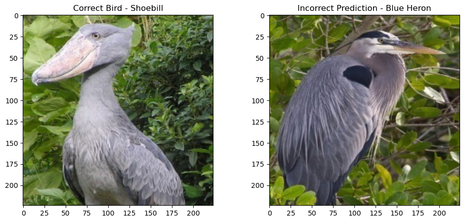

# Bird Species Image Classification:
### Using Computer Vision to Identify 525 Different Bird Species
##### David Hartsman and Heath Jones
[First Notebook](https://github.com/dvdhartsman/Bird_Species_Image_Classification/edit/main/README.md#:~:text=.gitignore-,Bird_Classification_1,-.ipynb)
Preliminary EDA | Plotting | Data Understanding

[Second Notebook](https://github.com/dvdhartsman/Bird_Species_Image_Classification/edit/main/README.md#:~:text=Bird_Classification_1.ipynb-,Bird_Classification_2,-.ipynb)
Subsequent Model Iterations | Final Model Built on EfficientNetB0 | Final Thoughts

[Streamlit App](https://bird-species-image-classification-heath-and-david.streamlit.app/)
Download/Upload some bird images and try out our model!

### Overview

In this project, we created a Convolutional Neural Network modeled on data from a Kaggle dataset containing roughly 90k images of 525 different bird species. We used tensorflow to create the Convolutional Neural Networks. The purpose of our project was to maximize our model's ability to predict the correct species of the bird from an image. 

### Data

The data in this project were "RGB" (3-channel, red-green-blue color) images with dimensions of 224 pixels by 224 pixels. The images were curated to be of very high resolution, and the birds make up a large percentage of each image.

This high-quality data provided the models with a substatial amount of "signal" to learn from, and aided in improving the accuracy of predictions. Tensorflow/Keras come with built-in classes and functions that made it easy to create a data pipeline directly from the local image directories to the model itself. We used several of the built-in functions to extract the numeric image data, scale it, and augment it, and also extract the correct labels from the data without having to explicitly code a labeling function. 

### Evaluation

This data was large enough to still require substantial time to train each model iteration. We used both [Tensorboard](https://www.tensorflow.org/tensorboard) and [Weights and Biases](https://wandb.ai/site) to create dashboards that tracked model performance across training epochs. The models also store and return dictionaries containing training logs for the metrics that were being tracked over each epoch of training. 

In the early stages of modeling, accuracy was topping out at around 40% after 20 epochs of training. The early models were relatively shallow, having a relatively few number of layers. we attempted to evaluate the predictions of these early models, and visually inspect the images of errant predictions. Even when the first model made incorrect predictions, there was a clear proximity to the correct species. Take for example, this incorrect prediction:

In order to improve upon the accuracy of the models, we learned a great deal about the EfficientNetB0 architecture. EfficientNet is a type of CNN that is designed to provide remarkable performance while limiting the number of trainable parameters. This effectively moderates the complexity of the model while still ensuring excellent accuracy.

### Conclusion

We were only able to achieve an accuracy of roughly 43% on our first model, however we were able to eventually achieve much better results by utilizing the EfficientNetB0 architecture and transfer learning. The Kaggle competition provided one such model that had been trained over 15 epochs. Using this architecture as the foundation for our model, we achieved `accuracy scores on test data of around 98%`. We additionally tested the model on "WILD" images taken from the internet, and the model still performed very well. 

The process for preparing this "wild" data for model predictions required resizing it from its natural pixel ratio to (224, 224, 3). Then, accounting for the model being trained on batches required addressing as well by using np.expand_dims([image_file], 0). This graphic shows an image as taken from the internet - the same image after reshaping - and an image of the same species from the training data. The model was able to correctly predict this internet image as an Abbott's Babbler.

This model has also been deployed on [streamlit](https://bird-species-image-classification-heath-and-david.streamlit.app/). We encourage you to test the model's predictive ability with any bird image that you can find, provided it is from a species found in the training data. In order to improve upon the model further, we believe that both more data and more computational resources would be required. With the level of accuracy already achieved from this model, pursuit of improved performance might prove difficult, and also debatably necessary. If you would like to examine the code, please feel free to explore the project in more detail by examining the [first notebook](https://github.com/dvdhartsman/Bird_Species_Image_Classification/blob/main/Bird_Classification_1.ipynb) and [second notebook](https://github.com/dvdhartsman/Bird_Species_Image_Classification/blob/main/Bird_Classification_2.ipynb). Thank you for stopping by, and feel free to [contact David](https://www.linkedin.com/in/david-hartsman-data/) or [Heath](https://www.linkedin.com/in/heefjones/) with any questions you may have. Take care!
